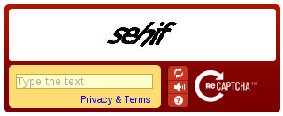

## play-recaptcha-example

This is an example web application showing how to use the 
[play-recaptcha](https://github.com/chrisnappin/play-recaptcha) module
with reCAPTCHA version 1 (the original). 

Please download the latest example code - [version 2.0](https://github.com/chrisnappin/play-recaptcha-example/releases/tag/release-2.0) which works with [play-recaptcha v2.0](https://github.com/chrisnappin/play-recaptcha/releases/tag/release-2.0-with-docs).

**Please note Google no longer issues new keys to use reCAPTCHA version 1** - it is highly recommended you upgrade to reCAPTCHA version 2 - see [example code](https://github.com/chrisnappin/play-recaptcha-v2-example) to use [play-recaptcha](https://github.com/chrisnappin/play-recaptcha) with reCAPTCHA version 2.

### License

The Play reCAPTCHA Module, and this example app, are copyright Chris Nappin, and are released under the 
[Apache 2 License](http://www.apache.org/licenses/LICENSE-2.0).

### Trademarks
Google and possibly reCAPTCHA are trademarks of Google Inc.
